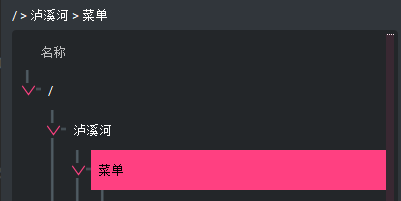

# 文件系统管理项目说明文档

## 项目说明

- 基本任务
  - 在内存中开辟一个空间作为文件存储器，在其上实现一个简单的文件系统
  - 退出这个文件系统时，需要该文件系统的内容保存到磁盘上，以便下次可以将其回复到内存中来
  
- 具体要求
  - 文件存储空间管理可采取链接结构（如FAT文件系统中的显式链接等）或者其他学过的方法
  - 空闲空间管理可采用位图或者其他方法
  - 文件目录采用多级目录结构，目录项目中应包含：文件名、物理地址、长度等信息
  - 需提供格式化，创建子目录，删除子目录，显示目录，更改当前目录，创建文件，打开文件，关闭文件，写文件，读文件，删除文件等操作

## 功能实现

### 各部分组件说明

- 顶部菜单栏，提供了所有文件操作，包括格式化，保存，增加/删除/重命名和关于，教程

  

- 上方地址栏显示当前选中文件/文件夹绝对路径

  

- 左侧文件目录，以树状结构展示文件架构

  

- 右侧文本编辑框，实时显示选中文件的内容，修改后点击下方`SAVE`按钮可保存

  

- 下方脚注显示当前选中文件/文件夹的信息

  

- 右键显示菜单

  

### 实现原理

1. 构建一个`FileSystem`类（见`file_system_components.py`，可以模拟文件系统的各种操作，其中：

   - 文件块用`FCB`类表示，存储其名称、长度、创建时间、修改时间
   - 磁盘存储用`Disk`类表示
   - 文件组织方式采用链接方式中的FAT方法。代码中构建了一个`FAT`类，以存储文件的链表存储结构。
   - 空闲区间用位图存储，以`FreeSpace`类表示
   - 多级目录用`FileTree`表示，其中：
     - `FileTreeNode`为多级目录中的文件夹结点
     - 多级目录中的文件结点直接为FCB，且一定为叶节点

2. 增加文件时，增加`FCB`块，并加入到`FileTree`中；写入时，额外写入到磁盘`Disk`中，同时将`FreeSpace`中对应位置赋值0：

   ```python
   cur_index = FAT_END
   
   while data != "":
       next_index = self.find_free_index()
       if next_index == -1:
           raise AssertionError("don't have enough space!!")
           if cur_index == FAT_END:
               fcb.start_address = next_index
               else:
                   self.fat.table[cur_index] = next_index
   
                   self.disk[next_index] = data[:BLOCK_SIZE]
                   data = data[BLOCK_SIZE:]
                   self.free_space.bitmap[next_index] = SPACE_OCCUPY
   
                   cur_index = next_index
                   self.fat.table[cur_index] = FAT_END
   ```

   删除文件同理：

   ```python
   cursor = fcb.start_address
   if cursor is not None:
       while cursor != FAT_END:
           self.disk[cursor] = ""
           self.free_space.bitmap[cursor] = SPACE_FREE
   
           next_position = self.fat.table[cursor]
           self.fat.table[cursor] = SPACE_FREE
   
           cursor = next_position
   ```

3. 构建对应的UI，并用PyQt中的`QTreeView`模拟左侧的树结构，每次操作后更新`QTreeView`中的model

## 运行方法

- 直接运行
  已经通过`pyinstaller`生成了Windows上的可执行文件。
  在Windows系统上点击`file_system_main.exe`，即可运行程序

- 编译运行

  * Python version：3.8

  * 安装PyQt5和qt-material（用来应用本程序所需的UI样式）和bitarray（用位图表示剩余空间）

    ```bash
    pip install PyQt5
    pip install qt-material
    pip install bitarray
    ```

  - 运行源码

    ```bash
    python file_system_main.py
    ```

## 运行截图


## 项目总结

### 项目亮点

- 采用PyQt5进行图形化开发，并应用`qt-material`，增加较多图标，较为美观
- 提供了菜单栏工具和右键选择菜单两种操作方式

### 改进方向

- 未来可以尝试采用别的文件管理策略